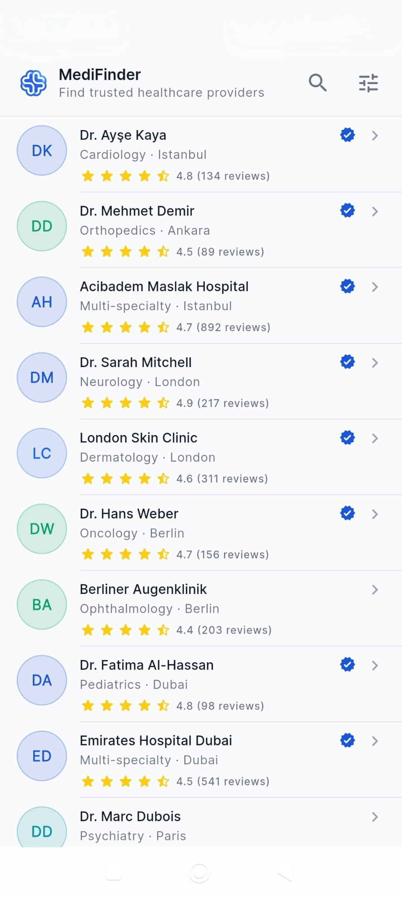
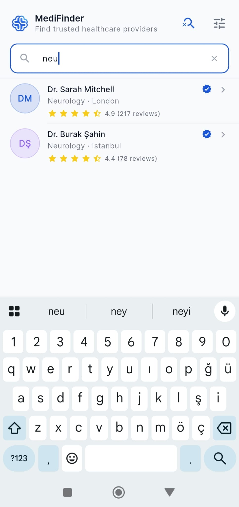
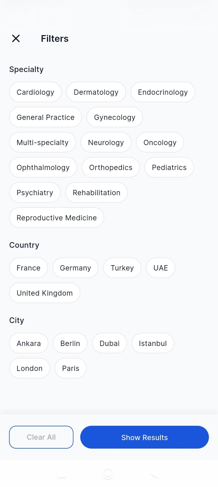

# Mobile Engineer Case Study - Provider Search

Bu proje, istenen "Sağlık Hizmeti Sağlayıcıları (Provider) Arama Akışı" görevini Flutter ile üretim kalitesine (production-ready) en yakın şekilde geliştirmek amacıyla hazırlanmıştır. Uygulama; Liste, Filtre ve Profil Detay olmak üzere 3 temel ekrandan oluşmaktadır.

## Demo APK İndir
Projeyi derlemekle uğraşmadan doğrudan telefonunuzda test etmek için Android APK dosyasını aşağıdan indirebilirsiniz:

[MediFinder Demo APK (v1.0.0) İndir](https://github.com/mahmutcancokcapar/medifinder_demo/releases/download/v1.0.0/app-release.apk)


## Ekran Görüntüleri

<p align="center">
  
  
  
</p>
<p align="center">
  
  
  
</p>

## Mimari Tercihler ve Kod Organizasyonu

Proje, ölçeklenebilirlik ve sürdürülebilirlik ilkelerine dayanarak **Feature-first Clean Architecture** prensipleriyle yapılandırılmıştır. `lib` dizini altında `core` (ortak bileşenler, sabitler, yönlendirme) ve `features` (bağımsız özellik modülleri) klasörleri bulunmaktadır.

Her özellik kendi içinde `domain` (iş kuralları ve veri modelleri), `data` (mock veriler ve repository) ve `presentation` (UI bileşenleri ve durum yöneticileri) katmanlarına ayrılarak "Separation of Concerns" (Sorumlulukların Ayrılığı) kuralı uygulanmıştır.

## State Yönetimi Yaklaşımı

Uygulamanın durum yönetimi (state management) için **Riverpod** (`riverpod_generator` ve `AsyncNotifier`) kullanılmıştır.
- **Neden Riverpod?** Asenkron veri akışlarını, arama/filtreleme mantığını ve uygulama durumlarını (loading, empty, error) en güvenli şekilde yönetmek için tercih edilmiştir.
- **Immutable State:** `freezed` kütüphanesi kullanılarak uygulama genelindeki tüm modeller (ProviderEntity, FilterEntity) değişmez (immutable) hale getirilmiş ve veri bütünlüğü garanti altına alınmıştır.

## Önemli Teknik Kararlar ve Dikkat Edilen Noktalar

- **Navigation Kurgusu:** Uygulama içi yönlendirmeler için deklaratif bir yapı sunan **go_router** kullanılmıştır. Sayfalar arası nesne taşımak yerine, derin bağlantılara (deep-link) hazır olması amacıyla sadece `id` üzerinden detay sayfasına geçiş yapılmıştır.
- **Null ve Eksik Veri Yönetimi:** Veri katmanında gelebilecek eksik `bio`, `phone` veya `email` gibi bilgiler UI katmanında dikkatle ele alınmış, verinin null olması durumunda arayüz kırılmalarını önleyen akıllı bileşen gizleme mekanizmaları kullanılmıştır.
- **Loading, Empty ve Error Durumları:** İsteklerin bekleme aşamasında skeleton (veya loading) arayüzleri, arama sonucunun bulunamaması durumunda özel `AppEmptyState`, herhangi bir hatada ise tekrar deneme (retry) imkanı sunan `AppErrorState` tasarımları kurgulanmıştır.
- **Component Yapısı (Yeniden Kullanılabilirlik):** Arama çubuğu (`AppSearchField`), liste elemanları, hata bileşenleri ve etiket (chip) tasarımları modüler bir widget hiyerarşisine oturtularak yeniden kullanılabilir hale getirilmiştir.
- **Kullanıcı Deneyimi (UX):** Liste geçişlerinde "Hero" animasyonları, filtreleme işlemlerinde klavyenin otomatik gizlenmesi (unfocus), sistemle entegre iletişim linkleri (`url_launcher`) ile akıcı bir kullanıcı deneyimi hedeflenmiştir.

## Bonus: Testler

Uygulamanın veri çekme ve filtreleme mantığının doğru çalıştığını kanıtlamak adına **mocktail** kullanılarak birim testleri (Unit Tests) ve temel UI bileşenleri için Widget testleri yazılmıştır. 

## Projeyi Çalıştırma

Projeyi bilgisayarınıza klonladıktan sonra:

```bash
# Bağımlılıkları yükleyin
flutter pub get

# Kod üretim aracını çalıştırın (freezed ve riverpod için)
dart run build_runner build -d

# Uygulamayı başlatın
flutter run

# Testleri koşturun
flutter test
```
